# Super Simple Software Factory

> **Repeatable agents-plus-code workflows, packaged as one skill, stamped into any repo.**
> Deterministic TypeScript owns the graph. Coding agents are bounded nodes inside it.

📺 Full breakdown on YouTube: **[Super Simple Software Factory](https://youtu.be/haUfb1ievTE)**

<p align="center">
  
</p>

<p align="center">
  
</p>

A software factory does one thing: it gives you more leverage on your prompt. How much leverage depends entirely on what you invest in it. At the low end you chain two agents together and hope. At the high end you build a system of agents plus code that runs without you, and does the job about as well as you would.

Everyone can get an agent to write code once. Almost nobody gets the same result twice. This fixes that by moving the control plane out of the prompt and into TypeScript. An ADW script (AI Developer Workflow) owns sequencing, retries, and acceptance. Agents work inside named phases. Typed JSON envelopes carry context across the seams. Every event streams into SQLite while it is still happening. **Agent proposes, code disposes.**

> [!NOTE]
> **This branch is the skill alone**, which is the thing you install. For a repo with the factory already stamped into it, a demo app it planned, built, tested, reviewed, and documented, and the real traces from those runs, see the **[`example` branch](../../tree/example)**.

---

## Why this exists

<p align="center">
  
</p>

Hand a capable model your whole SDLC and you get a machine with no seams. There is no phase boundary, so you cannot say which step failed. There is no acceptance criterion you can name, so "done" means "the agent stopped talking." A retry is a cold start that throws away everything the agent just learned. The only trace is a transcript you have to read like a novel. Run it twice, get two different systems.

The fix is not a better prompt. The fix is deciding, deliberately, that **code owns sequencing, retries, and acceptance, and the agent owns only the work inside one bounded phase**. Everything else falls out of that one line. Phases become the unit of the trace. Envelopes become the only way context crosses a seam. Gates become the definition of done. A correction becomes cheaper than a restart, because the session is still alive.

### Agents are great. You do not always need one.

This is the part most engineers are going to skip, and pay for later.

Code costs nothing. It runs at the speed of light. You can change it in a second. And you actually own it, which is not true of any model you are renting by the token.

So when the invocation is already known, write it down. `bun test` is not a judgement call. Neither is `ruff check`. An agent rediscovering your test runner burns a context window to learn what a subprocess already knows, and it charges you for the privilege every single run. Worse, it puts a passing test suite into a context window, which buys you nothing at all.

Agents are for the parts that need reading and deciding. Everything else is a `kind="code"` phase. When code fails, the failure comes back to the builder as an envelope, through the same door an agent's report would have used. The repair loop is identical. You just stopped paying an agent to do arithmetic.

The bill for skipping this is not only tokens. It is cost, speed, and consistency, and you pay it on run one hundred and run one thousand, not on run one.

> *Same models. Same prompts. The difference is who owns the loop.*

---

## Install

Two steps: get the skill into your repo, then stamp the factory.

### Agentic Install

Copy `.claude/skills/sssf/` into the target repo and type `/sssf install` inside Claude Code. The skill is named `sssf`, so that is the skill name followed by the `install` argument. There is no bare `/install` command. The agent reads the skill's own `cookbooks/install.md` and does the rest.

### Manual Install

**Prereqs:** [`bun`](https://bun.sh), `sqlite3`, the [`claude`](https://claude.com/claude-code) and [`codex`](https://developers.openai.com/codex/cli) CLIs (both signed in — the starter roster needs no API key), and [`pi`](https://github.com/mariozechner/pi-coding-agent) only if you add a `coding_agent: pi` agent. Bun runs the ADWs, the visualizer, and nothing else needs installing — `install.ts` fetches the one dependency (zod) into `adws/` for you.

```bash
# 1. get the skill into the target repo
mkdir -p .claude/skills
cp -r /path/to/super-simple-software-factory/.claude/skills/sssf .claude/skills/

# 2. stamp the factory (run from the target repo ROOT, the cwd is where everything lands)
bun .claude/skills/sssf/scripts/install.ts
claude login && codex login                      # the roster bills both subs — no API key
claude --version && codex --version               # confirm both are on PATH
git init && git commit --allow-empty -m init     # chains that end in a commit phase need a repo

# 3. smoke test: two cheap read-only runs, end to end
just demo
just sessions              # what just happened
just obs                   # the trace UI

# no just? every recipe is one line. the raw form of `just demo` is:
bun adws/adw_prompt.ts "reply with a one-line summary of this repo" --agent scout
```

Re-running `install.ts` is safe. It skips every file that already exists and reports what it skipped, so a second run doubles as a drift check. `--force` refreshes stamped code to the skill's current version, but it overwrites **all** stamped files including your `sssf.config.yaml` and your prompts, so commit first.

Green on the smoke test means the whole path works: config validated, session minted, the coding agent ran, envelope parsed, events landed in `adws/adw_data/sssf.db`. Fix it there before composing anything larger, because every multi-agent chain rides this exact path.

### Which API keys you actually need

**Out of the box, none.** The starter roster is entirely subscription-billed across two CLIs. Run `claude login` and `codex login` once each, and the whole roster works with an empty `.env`.

| Agent in the starter roster | Interface | Model | Thinking |
|---|---|---|---|
| planner | `claude_code` | `fable` | high |
| builder | `claude_code` | `sonnet` (inherited from `defaults.model`) | medium |
| reviewer | `codex` | `gpt-5.5` | high |
| documenter | `claude_code` | `sonnet` | medium |
| scout | `claude_code` | `haiku` | medium |

The reviewer is deliberately the odd one out: a reviewer drawn from the same family as the builder shares its blind spots, so it runs on your ChatGPT plan instead.

Do **not** set `ANTHROPIC_API_KEY` if you want subscription billing. Claude Code prefers an API key over the subscription, so `agent_cc.ts` strips it (and the Bedrock/Vertex switches) from the child environment — `SSSF_CC_USE_API_KEY=1` opts out. (Codex needs no such scrub: an `OPENAI_API_KEY` does not displace a ChatGPT login.) **Subscription agents report `cost: $0.00`** — nothing was metered per token, so the dollar column stays honest and tokens carry the usage signal.

**Keys come back the moment you add a `coding_agent: pi` agent.** Its `model:` is written `provider/model-id`, and the provider half decides the key (which key pi reads for a provider comes from `~/.pi/agent/models.json`). One sharp edge: `agents.validate()` checks that a pi model resolves in the catalog, not that its provider is reachable or its key is set. A missing key does not fail at startup — it fails when that agent runs, partway into a chain.

The sandbox and ticket loop add up to three more entries (`CLAUDE_CODE_OAUTH_TOKEN`, `CLICKUP_API_KEY`, and `GH_TOKEN` in one fallback case) — see [What goes in `.env`](#what-goes-in-env-and-what-does-not) below.


---

## Three principles

Everything here is built to be **observable**, **customizable**, and **reusable**. Those are not adjectives, they are the reason the parts are shaped the way they are.

**Observable.** If you cannot measure your agents, you cannot improve them. Every event goes into SQLite as it happens, so you can watch a run mid-flight, not read about it afterwards.

**Customizable.** One YAML file sets the core four for every agent: context, model, prompt, tools. Different models at different price and speed points, in the same run. It is not about which model is best anymore, it is about which model is right for that one phase.

**Reusable.** The whole thing is a skill you stamp into any repo, then bend to fit. The tests it ships are not your tests. The prompts it ships are starters. It is designed to be edited.

There are three actors here, and the design keeps them separate on purpose: **the engineer**, **the code**, and **the agents**. The trick is not running more agents. The trick is using all three at the right moment.

---

## The skill is the product

<p align="center">
  
</p>

Everything lives in `.claude/skills/sssf/`. `SKILL.md` carries the hard rules and routes each request to one of nine cookbooks. `references/` holds the deep specs, `scripts/` holds the generators, `templates/` holds exactly what gets stamped.

| What lands in your repo | Where it comes from | Tracked |
|---|---|---|
| `adws/adw_sssf_config/sssf.config.yaml` | `templates/sssf.config.yaml` | yes, it is your agent roster |
| `adws/adw_*.ts` | `templates/adws/` | yes, fifteen starter workflows |
| `adws/adw_modules/` | `templates/adws/adw_modules/` | yes, all low-level logic |
| `adws/adw_data/prompt_engineering/` | `templates/prompt_engineering/` | yes, **your prompts live here** |
| `adws/adw_data/harness_engineering/` | `templates/harness_engineering/` | yes, pi extensions |
| `.env.sample` | `templates/env.sample` | yes |
| `justfile` | `templates/justfile` | yes, starter recipes to run and watch |
| `adws/adw_data/sessions/`, `sssf.db` | created at runtime | no, gitignored |

The prompts are yours the moment they land. Edit them in `adws/adw_data/prompt_engineering/{agent}/`, never back inside the skill.

There is no DSL here. No framework to learn. It is TypeScript, YAML, agents, and a skill, which is exactly what these models are already trained on. Staying in distribution is a feature.

---

## The agent roster

`adws/adw_sssf_config/sssf.config.yaml` answers one question per entry: who is this agent. One agent, one prompt, one purpose.

```yaml
defaults:
  coding_agent: claude_code        # claude CLI on your subscription (or `pi` for API keys)
  model: sonnet                    # alias or claude-* id (pi models are provider/model-id)
  thinking: medium                 # off | minimal | low | medium | high | xhigh | max
  protected_files:                 # no agent may edit the machinery that grades it
    - adws/adw_modules/
    - adws/adw_sssf_config/
    - adws/adw_*.ts
  data_dir: adws/adw_data

agents:
  - name: planner
    model: fable
    thinking: high                 # per-agent overrides win over defaults
    color: "#a78bfa"               # this agent's lane swatch in the trace
    purpose: Turn a request into a plan the builder can implement without asking questions.
    prompt_engineering:
      system: adws/adw_data/prompt_engineering/planner/system.md
      user: adws/adw_data/prompt_engineering/planner/user.md
    writes:                        # the plan is all it may leave in the repo
      - specs/
```

Five starter agents ship in the box: `planner`, `builder`, `scout` (read-only recon), `reviewer`, and `documenter`. There is no tester, because running a suite is a known command and therefore code.

Every agent gets its own model, thinking level, prompts, tools, and harness. That is the core four, and it is the whole surface you tune. Give the planner a frontier model and the builder a cheap fast one. Give the scout subagents. Give the reviewer no ability to write code at all.

**`tools` is a capability list. `writes` is the boundary.** They are not the same thing, and the difference matters: `bash` runs anything, including `git checkout`, and `write` reaches any path. So "this agent changes nothing" is enforced in code, after every call, by comparing the repo before and after. Unauthorized changes are rolled back and the phase fails. A read-only agent is read-only with respect to your repo, never unable to write its own report.

Config defines who an agent **is**. The ADW call site defines how it is **used**. That split is what lets one agent serve many different calls. **ADW scripts never name a model, they name an agent.**

---

## Phases: three lanes, one primitive

<p align="center">
  
</p>

Every run is a sequence of phases, and every phase is the same primitive no matter who owns it.

```typescript
const REQUIRED_AGENTS = ["planner", "builder", "reviewer"];  // names, never models

const cfg = agents.load_config(config);
agents.validate(cfg, REQUIRED_AGENTS);   // a missing agent fails before anything spawns
const run = session.ensure(cfg, adw_id); // pin-or-create the session

const plan = await run.phase(
  PhaseParams({ name: "plan", kind: "agent", owner: "planner",
                description: "Turn the request into an implementable plan" }),
  (ph) => ph.call(AgentCall({ output_type: PlanOutput, prompt,
                              gates: [gates.artifacts_exist, gates.files_non_empty] })),
);

await run.phase(
  PhaseParams({ name: "commit", kind: "code", owner: "git",
                description: "Commit the working tree" }),
  (ph) => {
    const message = build.commit_message || `sssf(${run.adw_id}): ${build.summary}`;
    ph.log({ sha: git_helper.commit_all(message), message });
  },
);

return run.finish(review.approved, "the reviewer never approved");
```

Three kinds, three swim lanes. **engineer** is the human lane. **agent** is `ph.call(...)`: prompt in, typed envelope out, gates verified. **code** is a deterministic step that stands on its own, like a commit or a migration, and it is never buried inside an agent phase, so the trace shows exactly when code ran and when an agent was working.

That commit phase is the whole pattern in miniature. The builder proposes the message as a field on its envelope. Code decides whether to use it, falls back when it is empty, and performs the write. The agent never runs `git commit` itself.

**Success must be earned.** Every phase defaults to `fail`. A clean exit flips it, and an agent phase also needs its envelope to parse and every gate to come back green. `run.finish(accepted=...)` adds the second question, because phases passing is not the same as the run being acceptable: a test phase that ran a red suite did its job perfectly. One call settles the exit code, the session status, and the banner together, so they cannot disagree.

---

## Envelopes and gates

<p align="center">
  
</p>

An agent has exactly two output channels: reference files written into `context_handoff/`, and a final valid-JSON response parsed against the output type the call declared. Code persists that response as `envelope.json`, records it, and injects it into the next agent's prompt. Context transfers in code, not in conversation.

```typescript
const EnvelopeBaseSchema = z.object({
  status: z.enum(["success", "fail"]),
  summary: z.string().default(""),
  artifacts: z.array(z.string()).default([]),
  notes_for_next_agent: z.string().default(""),
});

export const BuildOutput = outputType("BuildOutput", EnvelopeBaseSchema.extend({
  changed_files: z.array(z.string()).default([]),
  commit_message: z.string().default(""),   // consumed by the git commit phase
}));
```

Field names stay snake_case throughout. They are quoted verbatim in every agent's `## Report` section and stored in the trace, so they are a wire contract with the models and the UI, not a style choice.

Determinism is wired into every step. Agents must return a specific structure, every time. If it does not parse, they get asked again until it does.

Gates verify claims, never predictions. Nobody knows which files an agent will touch before it finishes, so gates run **after** the fact against the envelope's own declarations: `artifacts_exist`, `files_non_empty`, `json_parses`, `diff_matches_claims`, `tests_pass(...)`. A gate is a callable with the signature `gate(envelope, run) -> GateReport`, one `check(item, ok, note)` per thing it examined, so a green gate tells you *what* it verified.

When JSON does not parse or a gate returns violations, **nothing restarts**. The harness re-prompts the same session with a correction naming exactly what was wrong, and the context window stays intact. Pi treats `--session-id` as create-or-continue, so running an agent and continuing it are the same call. A cold restart throws away everything the agent learned. A correction costs one message.

The output contract lives in three places and they are one thing: the type in `data_types.ts`, the JSON example in that agent's `user.md` `## Report` section, and `output_type=` at the call site. **Change one, change all three in the same edit.**

---

## The trace

<p align="center">
  
</p>

One data path, no exceptions: **agents write to SQLite, readers poll SQLite.** `agent_pi.ts` tails the coding agent's JSONL stdout line by line and the tracer inserts each event while the agent is still working, so tool calls are visible mid-run instead of batched at the end.

Ten event types land across seven tables: `sessions`, `phases`, `events`, `envelopes`, `gate_results`, `agent_sessions`, and `processes` (adw_id to pid, so a stuck run can be found and stopped). Every event logs against both its `adw_id` and its `phase_id`, and `parent_id` nests spans, so an agent phase expands into its own tool calls.

Pi announces a tool call across three raw events, so the interface folds them into exactly **one** `tool_call` row per real call. Each row is named the way you would read it aloud (`bash: ls -la src`) and carries `{tool, tool_call_id, args, result_snippet, ok, duration_ms, agent}`.

```sql
select * from events where adw_id = ? and rowid > ? order by rowid limit 500;
```

That one cursor query is the entire transport. Live view and full history are the same query at different cadence, which is why there is no ingest endpoint, no WebSocket, no backfill, and no separate replay path. Every connection opens WAL, so reads never block the running writers.

Files stay the raw record (`raw_output.jsonl`, `envelope.json`, `agent_map.json`). The db is the queryable mirror. Losing it loses nothing you cannot rebuild.

The skill ships a read-only UI for this db at `.claude/skills/sssf/apps/visualizer/`: Vue and Vite served by Bun on port 4600, with sessions, a trace waterfall, and per-phase tool-call detail.

```bash
cd .claude/skills/sssf/apps/visualizer && bun install
SSSF_DB=/abs/path/to/your-repo/adws/adw_data/sssf.db bun run server/index.ts &
bunx vite
```

It resolves its target through `--db`, then `SSSF_DB`, then `<cwd>/adws/adw_data/sssf.db`, so one instance can point at any stamped repo. Pass the db explicitly, because the server runs from the app dir.

---

## What is in this branch

```
super-simple-software-factory/          # the deployable factory, and nothing else
└── .claude/skills/sssf/
    ├── SKILL.md                        # hard rules + request routing table
    ├── cookbooks/                      # 9 orchestrator playbooks, loaded lazily
    ├── references/                     # config / handoff / observability specs
    ├── scripts/                        # install.ts, make_config.ts, make_adw.ts
    ├── apps/visualizer/                # the read-only trace UI (Vue + Vite on Bun)
    └── templates/                      # EXACTLY what install.ts stamps
        ├── sssf.config.yaml            # the starter roster
        ├── prompt_engineering/{agent}/ # system.md + user.md per agent
        ├── harness_engineering/        # pi extensions
        └── adws/
            ├── package.json            # the one dependency: zod
            ├── adw_*.ts                # the fifteen starter workflows
            └── adw_modules/            # ALL low-level logic, ADW scripts stay thin
```

The skill is also what an agent reads to *operate* the factory. `SKILL.md` is the central idea, and the cookbooks are lazily loaded recipes it pulls in one at a time: set up the factory, create an ADW, modify a chain, add an agent, run and monitor. If you can teach an agent to do something, teach it, then go build the thing it cannot.

---

## The fifteen starter workflows

Every ADW takes the same shape:

```bash
bun adws/adw_*.ts "<prompt or path/to/prompt.md>" [--config adws/adw_sssf_config/sssf.config.yaml] [--adw-id a1b2c3d4]
```

| ADW | Chain | Reach for it when |
|---|---|---|
| `adw_prompt` | engineer to \<agent\> | one agent, one prompt, `--agent NAME` picks who |
| `adw_scout` | engineer to scout | read-only recon, nothing changes |
| `adw_plan` | engineer to planner | you want the spec before any code |
| `adw_build` | engineer to builder | the plan already exists |
| `adw_quality` | engineer to code(quality) | lint, typecheck, build, no agents at all |
| `adw_plan_build` | planner, builder, git(commit) | small, well-understood work |
| `adw_build_test` | builder, code(test), bounded fix loop | there is a suite to satisfy |
| `adw_build_review` | builder, reviewer, bounded revise loop | "is this what was asked for" matters more than "does it run" |
| `adw_plan_build_test` | plan, build, code(test), git(commit) | the standard chain |
| `adw_plan_build_test_quality` | same, plus lint/typecheck/build gates | the repo has quality commands worth enforcing |
| `adw_document` | code(git diff), documenter | write up what just shipped |
| `adw_simple_sdlc` | plan, build, test, review, document | the work is real and its shape is not obvious |
| `adw_ticket_ship` | triage, sandbox dispatch, PR readback, watch, finalize | a ClickUp ticket in, a reviewed PR out — the whole loop below |
| `adw_sdlc_pr` | the simple-SDLC chain, then push + draft PR | runs INSIDE the sandbox VM; a dispatch launches it, you rarely do |
| `adw_pr_watch` | poll, classify, fix, push, reply, resolve | the in-VM daemon that serves review feedback until the humans decide |

`adw_simple_sdlc` lands three commits from three authors. The plan, the code, and the write-up each get their own, and each message is the words of the agent that produced it.

`--adw-id` is optional everywhere. Omit it and a fresh id is minted and printed. Supply it and the run joins that session: same dirs, same `context_handoff/`, and each agent **resumes its existing context window** through `agent_map.json` instead of starting cold. That is how you chain workflows.

```bash
bun adws/adw_plan.ts "add a /health endpoint"              # prints adw_id a1b2c3d4
bun adws/adw_build_test.ts "implement the plan" --adw-id a1b2c3d4
```

Watch a run with the trace db directly:

```bash
sqlite3 adws/adw_data/sssf.db "select adw_id, status, substr(request,1,60), total_tokens from sessions order by started_at desc limit 10;"
sqlite3 adws/adw_data/sssf.db "select seq, name, kind, owner, status from phases where adw_id='a1b2c3d4' order by seq;"
sqlite3 adws/adw_data/sssf.db "select kind, name, pid, command from processes where adw_id='a1b2c3d4' and ended_at is null;"
```

Reads never block a running workflow, the db is WAL. `install.ts` stamps a `justfile` wrapping all of the above, so in a fresh repo these are `just sessions`, `just phases <adw_id>`, `just tail <adw_id>`, and `just procs <adw_id>`.

---

## The sandbox and the ticket loop

The last three workflows in that table are one feature seen from three sides: **a ClickUp ticket in, a reviewed PR out, and nothing running on your machine.** `just ship PLFM-123` fetches the ticket, triages it host-side (an unclear ticket costs one cheap agent call and a comment with questions, never a VM), then boots a per-ticket [exe.dev](https://exe.dev) VM, provisions it, clones the repo, seeds a database, and runs the whole SDLC inside. The PR is created *from* the VM through exe.dev's GitHub integration — no token ever lands on the box. A watcher daemon stays behind to serve review feedback (inline threads *and* conversation-tab comments): classify, fix, test, push, reply, resolve. When a human merges, the ticket moves to done, the commits are harvested home into `refs/sandbox/`, and the VM is destroyed — the merge is the sign-off, and it is the system's one automatic teardown. Full walk-through: `cookbooks/sandbox.md`.

Two config blocks drive it, both in `sssf.config.yaml`, both fully commented in the stamped file. The `project:` block is the ticket tool:

```yaml
project:
  tool: clickup                    # none (default) disables the ticket loop
  team_id: "90121693723"           # the workspace id — a setting, not a secret
  statuses:                        # map the generic ladder onto YOUR list's real names
    todo: backlog                  # statuses are LIST-level in ClickUp; the driver
    in_progress: in development    # fetches the real names at runtime and degrades
    in_review: in review           # to a ticket comment when one is missing
    done: shipped
    needs_info: ""                 # "" = no such status on the board; comment-only
  progress_comments: true          # mirror run progress into ONE evolving ticket
                                   # comment, edited in place — no notification spam
```

The `remote:` block is the sandbox:

```yaml
remote:
  vm_prefix: ""                    # ticket ABC-123 -> VM <prefix>-abc-123
  tag: my-exe-tag                  # REQUIRED with a tag-scoped exe.dev SSH key; the
                                   # repo's GitHub integration must be attached to
                                   # this TAG (one VM is not enough — every ticket
                                   # gets a fresh box)
  clone_via: integration           # integration -> tokenless clone/push via
                                   # github.int.exe.xyz; token -> github.com + GH_TOKEN
  claude_auth: subscription        # ship CLAUDE_CODE_OAUTH_TOKEN, bill your Claude plan
  codex_auth: gateway              # keyless exe.dev LLM gateway; never copy auth.json
  setup_cmds:                      # repo toolchain, run in the clone before the seed;
    - "sudo corepack enable"       # each command MUST be idempotent (VM reuse re-runs)
    - "yarn install --immutable"
  postgres:
    enabled: true                  # apt install, role + db, DATABASE_URL exported
    version: 16
    db: app
    user: app
    password: app                  # VM-local; rotate nothing, it dies with the VM
    seed_cmd: ["bun", "run", "db:seed"]
  pr:
    enabled: true                  # push the run branch + open a draft PR from the VM
                                   # (requires clone_via: integration, WRITE-enabled)
    base: ""                       # "" = the repo's default branch
    draft: true
    labels: []
    reviewers: ["Copilot"]         # requested on creation; the watcher re-requests a
                                   # reviewer after fixing their findings
    signature: ""                  # appended to watcher replies; "" = unsigned. The
                                   # integration acts AS YOU, so unsigned replies are
                                   # indistinguishable from comments you typed
    include_workshop: false        # keep specs/ + app_docs/ OUT of the PR; the app doc
                                   # becomes the PR body instead (🤖 footer marks it)
  web:
    enabled: false                 # point https://<vm>.exe.xyz at your app's port
    port: 0                        # 0 = provider default (8000)
    public: false                  # false = gated behind exe.dev login — good previews
```

Sizing (`cpu`, `memory`, `disk`), `repo` (when origin is not the repo to clone), `sync_interval_s`, `adws_dirs`, and `env_passthrough` round out the block — the stamped comments cover them. A repo whose factory is not committed still works: the dispatch copies `adws/` + `justfile` in and excludes them from git, so they never leak into the PR.

### What goes in `.env` (and what does not)

One rule decides it: **if it is safe to commit, it is `sssf.config.yaml`; `.env` is only for secrets.**

| Key | Needed when | What it is |
|---|---|---|
| `CLAUDE_CODE_OAUTH_TOKEN` | `claude_auth: subscription` (the default) | `claude setup-token` output — the credential shipped to the VM so in-VM agents bill your Claude plan. Revocable; treat it that way |
| `CLICKUP_API_KEY` | `project.tool: clickup` | your personal token — the **only** ClickUp secret. The workspace id is config (`project.team_id`), not a secret |
| `GH_TOKEN` | `clone_via: token` only | a fine-grained PAT scoped to ONE repo, Contents: Read. The default `clone_via: integration` needs no token at all |

Everything else stays out on purpose. Codex needs no key (`codex_auth: gateway` runs it keylessly against exe.dev's LLM gateway) — and never copy `~/.codex/auth.json` to a VM: OpenAI rotates refresh tokens, and the shared file corrupts whichever side refreshes second, including your local login. Secrets travel to the VM over the ssh pipe, never argv, never the trace; the ClickUp key never travels at all — every board mutation is host-side.

The stamped `justfile` wraps the loop: `just ship PLFM-123` end to end, `just ship-watch PLFM-123` to re-enter the merge watch after a laptop nap, and the `sandbox-*` family (`sandbox-sdlc`, `sandbox-ls`, `sandbox-watch`, `sandbox-harvest`, `sandbox-web`, `sandbox-rm`) for driving VMs directly. Two facts to hold on to: **exe.dev VMs bill until removed**, and outside the merge-triggered finalize nothing here destroys one — teardown is your explicit call.

---

## Where it can still fail

Honest edges, because knowing them is cheaper than discovering them.

| Failure | What actually happens | What to do |
|---|---|---|
| The test phase reports green on a fresh install | `quality.ts` ships placeholder commands that exit 0. Three ADWs run them as their test phase | Wire your real commands into `quality.ts` before trusting `adw_build_test`, `adw_plan_build_test`, or `adw_simple_sdlc`. This is the first thing to customize |
| A bare model pattern on a **pi** agent | The same model sits under several providers, so `gemini-3.6-flash` matches three catalog entries and `agents.validate()` refuses to spawn | Always write `provider/model-id` (claude_code models are aliases or `claude-*` ids instead) |
| `just` is not installed | The stamped `justfile` is a convenience wrapper, nothing depends on it | Every recipe is a one-line `bun` or `sqlite3` command. Open the justfile and run the line yourself |
| A coding agent hangs silently | No events, no tokens, an empty `raw_output.jsonl`. The trace goes quiet rather than red | Query `processes` for what is alive and kill it children-first. A killed run finalizes its own trace to `fail` |
| The synced triad drifts | Type, `## Report` example, and `output_type=` disagree, so every call burns correction rounds | Grep the type name and fix all three in one edit |
| Gates pass, output is bad | Gates check what a predicate can check, not plan quality or code taste | Run the `reviewer`, or read it yourself |
| An agent edits something it should not | Detected and rolled back after the call, and the phase fails | Expected. Widen that agent's `writes` if the change was legitimate |
| Commit phase has nothing to commit | `commit_all` raises if the cwd is not a git repo or nothing changed | `git init` with one commit first. A no-op build fails the phase rather than committing nothing |
| `install.ts --force` | Overwrites **all** stamped files, config and prompts included | Commit before you force |
| Subscription agents report `$0.00` | `cost` means money actually billed, and a subscription meters nothing per token | Expected. Read tokens, not dollars — `SSSF_CC_USE_API_KEY=1` reports real API spend |

The plain workflows run on your current branch — for real work, that is what the sandbox and ticket loop are for: a branch per run, a VM around the agents, a PR as the merge step, and the human merge as the sign-off.

**Is this overkill for a one-off feature?** Yes. Prompt an agent and move on. This earns its keep when the same workflow runs a hundred times, when validation is the only thing standing between you and a bad merge, and when you need the thousandth run to look like the first.

---

## Built to be Observed, Customized, and Reused

This is a starting point, not a product. Nothing here is meant to survive contact with your codebase unchanged.

The tests it ships are not your tests. The prompts it ships describe a demo app, not your domain. The roster names the models that were good the week it was written. All of that is supposed to be replaced, and the whole thing is shaped so that replacing it is a small edit in an obvious file instead of a rewrite. That is what those three properties are for. **Observable** so you can see which part is actually costing you. **Customizable** so the fix is one file. **Reusable** so you do it once and stamp it everywhere.

Where to start, roughly in the order that pays off fastest:

| Change | File | Why |
|---|---|---|
| Your real commands | `adws/adw_modules/quality.ts` | The shipped blocks are placeholders that exit 0. Until you wire this, your test phase is theater |
| Your prompts | `adws/adw_data/prompt_engineering/{agent}/` | Where your standards live: what a good plan looks like, what a review has to catch |
| Your roster | `adws/adw_sssf_config/sssf.config.yaml` | Models, thinking levels, tools, and what each agent is allowed to write |
| Your chains | `adws/adw_*.ts` | Copy the closest workflow and edit the phase list. They are 40 to 180 lines on purpose |
| Your definition of done | `adws/adw_modules/gates.ts` | A gate is one function. Whatever "done" means where you work, write it here |
| Your agent capabilities | `adws/adw_data/harness_engineering/` | Pi extensions, a different set per agent if that is what the job needs |

The core deliberately stays small: the plain workflows run on your current branch with no approval phase, so the whole control plane reads in one sitting — which is the only reason you would trust it enough to change it. When the work is real, the sandbox and ticket loop add the missing rigor as opt-in config, not core complexity: a branch per run, a VM around the agents, a draft PR as the merge step, and a human merge as the only approval that counts.

So take it. Fork it, strip the parts you do not need, rename the agents, throw out half the workflows, and roll what is left into the factory your product actually needs. The specific chains in here matter far less than the shape: code owns the loop, agents own the phases, and every run leaves a trace you can go read.

---

## See it in a real repo

The [`example` branch](../../tree/example) is this same skill with the factory already stamped in: a populated `adws/`, a `justfile`, a demo app the factory planned, built, tested, reviewed, and documented, and the specs, docs, and traces those runs produced.

```bash
git clone <this-repo> sssf && cd sssf
git checkout example
```

---

## License

MIT, see [`LICENSE`](LICENSE).

---

## Master Agentic Coding

<p align="center">
  
</p>

Vibe coding is not knowing how your system works, and not looking. Agentic engineering is knowing how your system works so well that you do not have to look.

Master agentic coding by gaining a deeper understanding of the foundational units of the software factory.

Learn tactical agentic coding patterns with [Tactical Agentic Coding](https://agenticengineer.com/tactical-agentic-coding?y=sssf).

Follow the [IndyDevDan YouTube channel](https://www.youtube.com/@indydevdan) to improve your agentic coding advantage.

---

Stay Focused and Keep Building

- IndyDevDan
